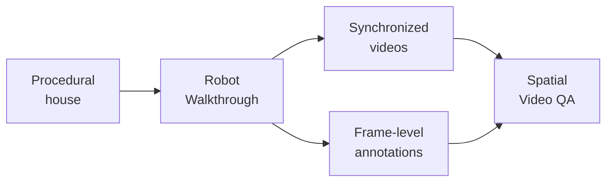

<div align="center">

# SIMS-V: Simulated Instruction-Tuning for Spatial Video Understanding

[](https://arxiv.org/abs/2511.04668)
[](https://arxiv.org/pdf/2511.04668)
[](https://ellisbrown.github.io/sims-v/)
[](https://huggingface.co/datasets/ellisbrown/SIMS-VSI)

</div>

SIMS-V generates spatial video-training data from AI2-THOR and ProcTHOR. A
simulated Stretch robot tours procedural houses while the pipeline records RGB,
depth, segmentation, and structured annotations. Those recordings can then be
converted into spatial, temporal, and descriptive video question-answer pairs.




The associated paper uses these data to study which properties of simulation
produce spatial reasoning that transfers to real video. A 7B video-language
model trained on 25K simulated examples outperforms substantially larger
72B baselines on VSI-Bench while retaining general video-understanding
performance.

## Quick start

The locked environment uses Python 3.9 and
[`uv`](https://docs.astral.sh/uv/):

```bash
uv sync --locked
uv run python -m nltk.downloader wordnet wordnet2022
```

Trajectory generation does not require CUDA. On systems without CUDA, SIMS-V
uses one CPU worker, but AI2-THOR still needs a working graphics backend. macOS
uses AI2-THOR's desktop build; Linux requires a Vulkan renderer. An NVIDIA GPU
is the tested and strongly recommended setup for practical throughput.

To record one short ProcTHOR walkthrough:

```bash
uv run sims-v generate \
    --dataset-dir outputs/demo \
    --house-dataset procthor \
    --split val \
    --max-houses 1
```

The primary video is written to a path such as
`outputs/demo/val/000000/rgb__0.mp4`. Generate metadata and
video QA from the recording with:

```bash
uv run sims-v qa \
    --dataset-dir outputs/demo \
    --split val \
    --question-types vsi_obj_count
```

Run `uv run sims-v generate --help` or `uv run sims-v qa --help` for the full
set of options.

## What is generated

With the default modalities, a representative output directory after
trajectory generation and QA looks like this:

```text
outputs/demo/
├── constants.yaml                         # Generation settings and resume guard
├── generation_logs/
│   ├── logs.tsv                           # Per-house timing and outcomes
│   └── metrics.json                       # Aggregate success/failure counts
├── val/
│   ├── 000000/                            # One successfully generated house
│   │   ├── house_spec.json                # Complete procedural scene specification
│   │   ├── rgb__0.mp4                    # Primary RGB walkthrough
│   │   ├── offline_annos__0.jsonl         # Per-frame pose and visible-object data
│   │   ├── hdf5_sensors.hdf5              # Other per-frame task/controller sensors
│   │   ├── success.txt                     # Completion and resume marker
│   │   ├── spatial_metadata.json           # Room and 3D-object geometry from QA
│   │   └── qa_pairs_vsi_obj_count__0.jsonl # Per-video generated questions
│   └── combined_qa_pairs.jsonl             # QA candidates merged across houses
└── qas/val/rgb/
    └── mt1_vsi_obj_count_mc.jsonl          # Final model-training conversations
```

The `__0` suffix identifies trajectory 0; additional trajectories use `__1`,
`__2`, and so on. See the [QA pipeline](docs/qa-pipeline.md#video-modalities)
for every video modality and formatting option.

Optionally, generate additional video modalities with:

```bash
uv run sims-v generate \
    --dataset-dir outputs/demo-with-ablations \
    --extra-video-modalities depth semantic_seg edge
```

| Modality | Added file | Contents |
|---|---|---|
| `depth` | `depth__N.mp4` | Fixed-scale depth visualization |
| `semantic_seg` | `semantic_seg__N.mp4` | Semantic-class masks |
| `instance_seg` | `instance_seg__N.mp4` | Object-instance masks |
| `edge` | `edge__N.mp4` | Binary instance boundaries |
| `colored_edge` | `colored_edge__N.mp4` | Instance-colored boundaries |
| `non_overlapping_colored_edge` | `non_overlapping_colored_edge__N.mp4` | Separated colored boundaries |
| `mean_mask_overlay` | `mean_mask_overlay__N.mp4` | Instances filled with their mean RGB |
| `masked_background` | `masked_background__N.mp4` | RGB with wall/room regions masked |

Use `--extra-video-modalities all` to output all modalities.

The generator supports standard ProcTHOR houses and the public
ProcTHOR-Objaverse asset collection used in the paper.

## Documentation

- [Getting started](docs/getting-started.md): installation, datasets, and
  walkthrough generation
- [QA pipeline](docs/qa-pipeline.md): question types, formatting, and output
  layout
- [Paper settings](docs/paper-settings.md): paper generation settings and the
  source recipe for the 3Q mixture
- [Cluster setup](docs/cluster.md): headless NVIDIA and Slurm guidance
- [Development](docs/development.md): architecture and repository checks

## Citation

```bibtex
@article{brown2025simsv,
  title = {{SIMS-V}: Simulated Instruction-Tuning for Spatial Video Understanding},
  author = {Brown, Ellis and Ray, Arijit and Krishna, Ranjay and Girshick, Ross and Fergus, Rob and Xie, Saining},
  journal = {arXiv preprint arXiv:2511.04668},
  year = {2025},
}
```

## License

SIMS-V source code is licensed under the Apache License 2.0. Datasets, model
weights, simulator assets, and third-party dependencies remain subject to their
respective licenses. See [LICENSE](LICENSE).
